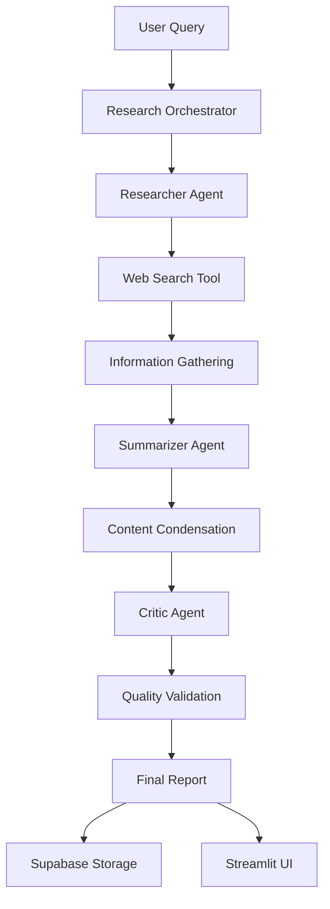

# 🤖 Autonomous Research Team - Multi-Agent AI Research System

<div align="center">


**An intelligent multi-agent system that autonomously conducts research using specialized AI agents working in collaboration**

[Demo](#demo) • [Features](#features) • [Installation](#installation) • [Usage](#usage) • [Architecture](#architecture) • [Contributing](#contributing)

</div>

## 📖 Overview

The Autonomous Research Team is a sophisticated AI-powered research assistant that employs three specialized agents working in harmony to conduct comprehensive research on any topic. Unlike traditional chatbots, this system divides the research process among specialized AI agents that collaborate to deliver well-researched, summarized, and quality-checked reports.

## 🎯 What It Does

| Agent | Role | Function |
|-------|------|----------|
| 🔍 **Researcher** | Information Gatherer | Searches the web for current, credible information |
| 📝 **Summarizer** | Content Analyst | Condenses findings into clear, concise summaries |
| ✅ **Critic** | Quality Assurance | Validates accuracy and identifies gaps in research |

## ✨ Key Features

- **🤖 Multi-Agent Collaboration**: Three specialized AI agents working in sequence
- **🔍 Real-Time Web Search**: Integrated DuckDuckGo search for current information
- **🧠 Google Gemini Powered**: State-of-the-art AI model for intelligent analysis
- **💾 Persistent Storage**: Supabase integration for saving research history
- **🎨 Streamlit UI**: Beautiful, interactive web interface
- **⚡ Async Processing**: Efficient parallel task execution
- **📊 Quality Assurance**: Built-in critique and validation system
- **🔒 Environment Config**: Secure API key management

## 🛠️ Technology Stack

| Component | Technology |
|-----------|------------|
| **AI Framework** | CrewAI, LangChain |
| **AI Model** | Google Gemini 1.5 Flash |
| **Frontend** | Streamlit |
| **Database** | Supabase (PostgreSQL) |
| **Search** | DuckDuckGo Search API |
| **Language** | Python 3.8+ |

## 🚀 Quick Start

### Prerequisites

- Python 3.8 or higher
- Google Gemini API key
- Supabase account (optional, for database features)

### Installation

1. **Clone the repository**
   ```bash
   git clone https://github.com/yourusername/autonomous-research-team.git
   cd autonomous-research-team
   ```

2. **Install dependencies**
   ```bash
   pip install -r requirements.txt
   ```

3. **Set up environment variables**
   Create a `.env` file in the root directory:
   ```env
   # Required for AI functionality
   GOOGLE_API_KEY=your_google_gemini_api_key_here
   
   # Required for database storage (optional)
   SUPABASE_URL=your_supabase_project_url_here
   SUPABASE_KEY=your_supabase_anon_public_key_here
   ```

4. **Run the application**
   ```bash
   streamlit run app.py
   ```

5. **Open your browser**
   Navigate to `http://localhost:8501`

## 📁 Project Structure

```
autonomous-research-team/
├── app.py                 # Main Streamlit application
├── requirements.txt       # Python dependencies
├── .env                  # Environment variables (create this)
├── agents/               # AI agent definitions
│   ├── researcher.py     # Research agent
│   ├── summarizer.py     # Summarization agent
│   └── critic.py         # Quality assurance agent
├── database/             # Database operations
│   └── supabase_client.py
├── tools/                # Research tools
│   └── research_tools.py
├── utils/                # Helper functions
│   ├── helpers.py
│   └── gemini_setup.py
└── config/               # Configuration settings
    └── settings.py
```

## 💡 Usage

### Basic Research Flow

1. **Enter Query**: Type your research topic in the main interface
2. **Start Research**: Click "Start Research" to initiate the process
3. **Watch Progress**: Observe as three agents work sequentially:
   - 🔍 Researcher gathers information
   - 📝 Summarizer condenses findings
   - ✅ Critic validates quality
4. **Review Results**: Access comprehensive reports with:
   - Executive summary
   - Detailed research findings
   - Quality assessment

### Example Queries

- "Latest developments in artificial intelligence 2024"
- "Renewable energy trends and innovations"
- "Space exploration recent achievements"
- "Climate change mitigation technologies"

## 🏗️ System Architecture



## 🔧 Configuration

### Environment Variables

| Variable | Description | Required |
|----------|-------------|----------|
| `GOOGLE_API_KEY` | Google Gemini API key | ✅ Yes |
| `SUPABASE_URL` | Supabase project URL | ❌ Optional |
| `SUPABASE_KEY` | Supabase anon public key | ❌ Optional |

### API Keys Setup

1. **Google Gemini API**:
   - Visit [Google AI Studio](https://makersuite.google.com/app/apikey)
   - Create API key and add to `.env`

2. **Supabase** (optional):
   - Create project at [Supabase](https://supabase.com)
   - Get credentials from Settings → API
   - Run provided SQL schema to create tables

## 🎨 Features in Detail

### Research Tab
- Interactive query input with examples
- Real-time progress tracking
- Multi-phase execution visualization

### Results Tab  
- Executive summary display
- Detailed research findings
- Quality assessment report
- Session information

### History Tab
- Local session management
- Database integration
- Session loading and deletion

## 🤝 Contributing

We welcome contributions! Please feel free to submit pull requests, report bugs, or suggest new features.

### Development Setup

1. Fork the repository
2. Create a feature branch: `git checkout -b feature/amazing-feature`
3. Commit changes: `git commit -m 'Add amazing feature'`
4. Push to branch: `git push origin feature/amazing-feature`
5. Open a pull request

### Code Style
- Follow PEP 8 guidelines
- Use type hints where possible
- Include docstrings for functions
- Add comments for complex logic

## 📄 License

This project is licensed under the MIT License - see the [LICENSE](LICENSE) file for details.

## 🐛 Troubleshooting

### Common Issues

1. **API Key Errors**: Verify your `.env` file is correctly formatted
2. **Module Not Found**: Ensure all dependencies are installed from `requirements.txt`
3. **Database Connection**: Check Supabase credentials and table schema
4. **Rate Limiting**: Google Gemini has usage limits - wait between requests

### Getting Help

- Check the [Issues](https://github.com/yourusername/autonomous-research-team/issues) page
- Create a new issue with detailed description
- Include error messages and environment details

## 🔮 Future Enhancements

- [ ] Additional specialized agents (Data Analyst, Fact Checker)
- [ ] Export functionality (PDF, Markdown, JSON)
- [ ] Advanced search filters and sources
- [ ] Collaborative research sessions
- [ ] API endpoint for programmatic access
- [ ] Mobile application
- [ ] Plugin system for custom tools

## 🙏 Acknowledgments

- [CrewAI](https://www.crewai.com/) for the multi-agent framework
- [Google Gemini](https://deepmind.google/technologies/gemini/) for AI capabilities
- [Streamlit](https://streamlit.io/) for the web interface
- [Supabase](https://supabase.com/) for database backend

## 📞 Contact

For questions, suggestions, or collaborations, please reach out:

- **Project Maintainer**: Abhiram Rangoon
- **Email**: abhiramrangoon@gmail.com

---

<div align="center">

**Built with ❤️ by Abhiram Rangoon**

*If this project helps your research, please give it a ⭐!*

</div>